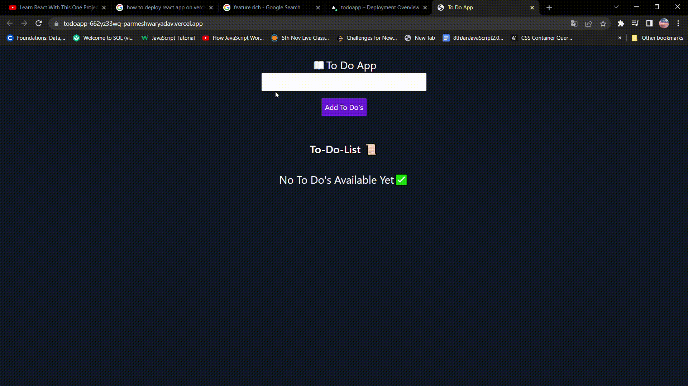

!# To-Do-App

A Simple To DO App build using with react &amp; tailwind

<H2 align="center">
<a href="https://todoapp-662yz33wq-parmeshwaryadav.vercel.app/">
👉 To DO APP</a>
</h2>

<p align="">
    
    
</P>



## How To Use

To clone and run this application, you'll need [Git](https://git-scm.com) and [Node.js](https://nodejs.org/en/download/) (which comes with [npm](http://npmjs.com)) installed on your computer. From your command line:

```bash
# Clone this repository
$ git@github.com:Parmeshwaryadav/To-Do-App.git

# Go into the repository
$ cd To DO App

```

## Credits

this to do app is solely build to learn the basic concepts of react like state management & Component based approach.

## Currently working on...

This project can be more feature-rich as below,

- adding Task/Todo items components/cards

- Adding a Login feature, Etc.
